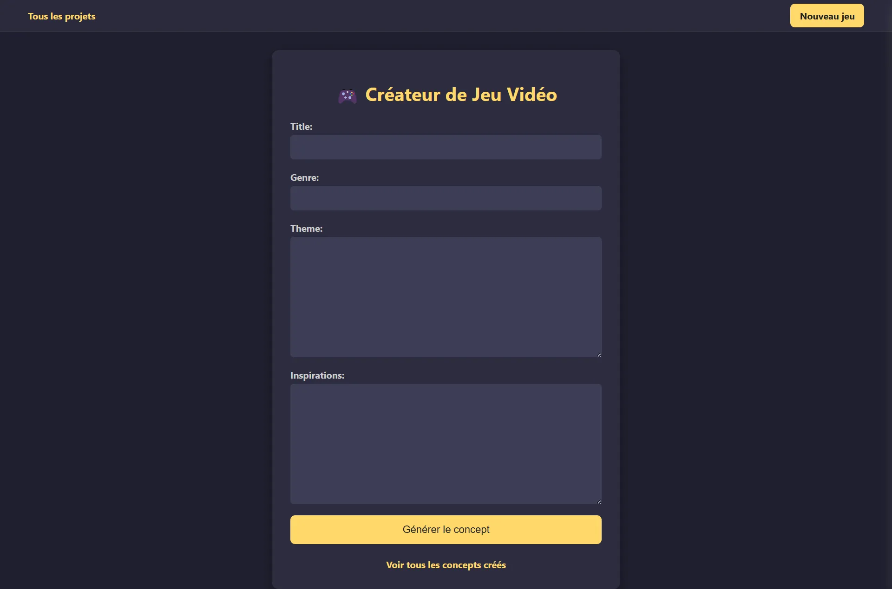
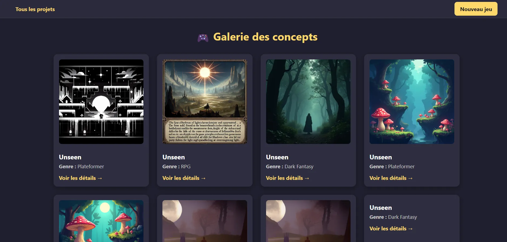
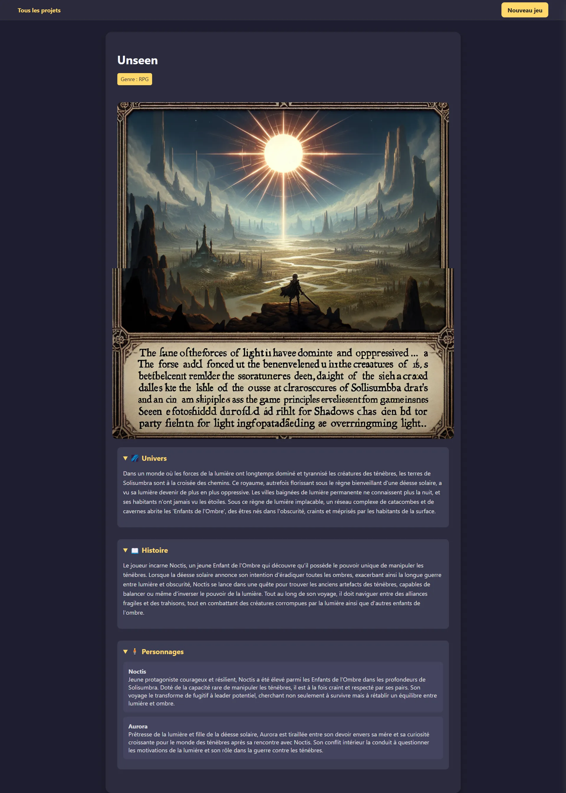

# Project Guidelines
    
# TP - Django - GameForge

## 📝 **GameForge – Générateur de jeux vidéo par IA**

---

### 🎯 Objectif

Développer une **plateforme web complète avec Django** permettant à des utilisateurs de créer des concepts de jeux vidéo originaux à l’aide de modèles d’intelligence artificielle (Hugging Face : https://huggingface.co/).

L'application devra permettre de générer automatiquement :

- Un **univers de jeu cohérent** (type, ambiance, style graphique)
- Une **histoire principale immersive** (scénario structuré)
- Une **galerie de personnages** (rôles, capacités, motivations)
- Des **illustrations conceptuelles** (visuels des environnements ou personnages)
- Une **fiche de présentation du jeu** (présentation complète type “pitch deck”)

---

### 🧩 Fonctionnalités principales

### 1. Formulaire de création guidée

L'utilisateur renseigne :

- Genre du jeu : *RPG, FPS, Metroidvania, Visual Novel…*
- Ambiance visuelle et narrative : *Post-apo, onirique, cyberpunk, dark fantasy…*
- Mots-clés thématiques : *boucle temporelle, vengeance, IA rebelle…*
- Références culturelles (facultatif) : *Zelda, Hollow Knight, Disco Elysium…*

### 2. Génération assistée par IA (via un fournisseur de modèles)

- Génération structurée de l’univers
- Création d’un scénario en **3 actes** avec retournement narratif
- Élaboration de **2 à 4 personnages** : nom, classe, rôle narratif, background, gameplay
- Création de **lieux emblématiques** avec descriptions immersives

### 3. Génération d’images conceptuelles

- Utilisation d’un modèle text-to-image (Stable Diffusion par exemple)
- Génération de visuels stylisés pour un personnage et un environnement

### 4. Mode “exploration libre”

- Génération complète aléatoire (sans formulaire) pour inspiration

### 5. Pages (au minimum)

- Page d’inscription
- Page de connexion
- Page d’accueil
    - Page d’accueil avec tous les jeux générés par les utilisateurs (le pseudo du générateur apparait pour chaque jeu)
- Tableau de bord
    - Chaque jeu est sauvegardé dans un tableau de bord personnel (page sur laquelle il y a tous les jeux générés par l’utilisateur en cours)
- Page de détail
    - Chaque jeu a une page de detail
- Il y a une page favoris
    - Avec la liste des jeux mis en favoris

- Il y a une barre de navigation

---

### 🔐 Authentification & Sécurité

- Système d’authentification complet (connexion, inscription, déconnexion)
- **Protection des projets** (accès uniquement pour l’auteur avec un toggle pour passer ses projets en Public/Privé)
- **Limitation d’usage API par utilisateur** (anti-spam)

---

### 🎁 Bonus (exemples non exhaustifs)

- 📖 **Système de narration dynamique** : le scénario peut évoluer selon les choix
- 📦 **Export PDF stylisé** : fiche jeu auto-maquettée (style Steam/itch.io)
- 🧙 **Système de “favoris” ou “like”**
- 🔍 **Barre de recherche** pour filtrer les jeux (selon leur nom, leur type, la date…)
- ⚙️ **Page de paramètres de compte** pour modifier ses informations
- 💬 **Pop-ups de chargement** pendant la génération
- 👾 **GDD** complet (Game Design Document)
- Et d’autres !

---

### Exemple simplifié de visuels

---

### 📦 Livrables

- Lien Github contenant :
    - Le projet dans son entièreté (pas de bdd)
    - Un [README.md](http://README.md) detaillé incluant :
        - Une présentation du projet
        - Les instructions pour installer, lancer le projet, créer la base de données, etc
        - Les modèles que vous avez utilisés
        - Des screenshots de votre application
        - La liste des bonus que vous avez implémenté
        - La liste des choses que vous n’avez pas réussi à implémenter
        - Toute information supplémentaire qui vous ferait plaisir !